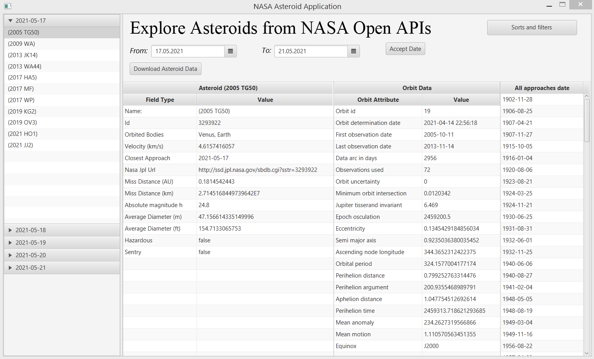
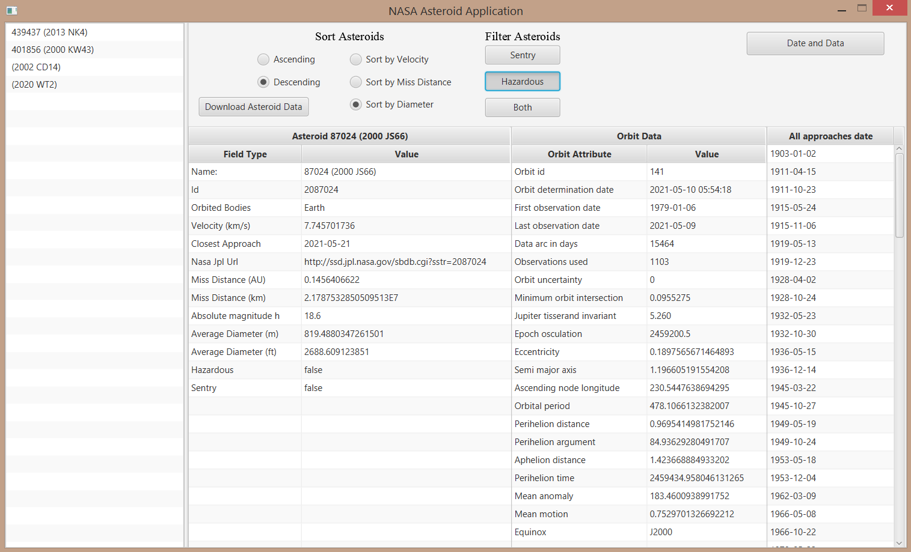

<!-- https://github.com/othneildrew/Best-README-Template -->
<!-- TABLE OF CONTENTS -->

  
<h2 style="display: inline-block">Table of Contents</h2>

  <ol>
    <li>
      <a href="#about-the-project">About The Project</a>
    </li>
    <li>
      <a href="#getting-started">Getting Started</a>
      <ul>
        <li><a href="#installation">Installation</a></li>
      </ul>
    </li>
    <li><a href="#usage">Usage</a></li>
    <li><a href="#contact">Contact</a></li>
  </ol>

<!-- ABOUT THE PROJECT -->
## About The Project

This project was created as the final submission for course Advanced Objective Programming (Zaawansowane programowanie obiektowe i funkcyjne). Created by Szymon Rećko and Mateusz Sperkowski. The application uses data downloaded during program's execution, from NASA's Asteroids - NeoWs API.

<!-- GETTING STARTED -->
## Getting Started

To get a local copy up and running follow these simple steps.

### Installation

1. Clone the repo
   
   git clone https://github.com/https://github.com/MattS0000/NASA_Asteroids_App
   
2. Add dependencies: gson-2.8.6 and JavaFX 15

<!-- USAGE EXAMPLES -->
## Usage

### Main Page

After launching the app we can explore automatically loaded data, or insert two dates between which we want to explore the data. Date selection is confirmed by the 'Accept Date' button. Then one can choose a specific Asteroid and download it's specific data using the 'Download' button. To go to the other page, click 'Sorts and Filters' button.

### Sorts and Filters Page
Here we can sort and filter data downloaded in the previous page. Eg. to learn more about the fastest asteroid in the period, we choose: 'Descending' and 'Sort by Velocity', then choose the top asteroid and click 'Download Asteroid Data' button.

<!-- CONTACT -->
## Contact

Szymon Rećko - [GitHub](https://github.com/Szymon164)

Mateusz Sperkowski - [GitHub](https://github.com/MattS0000)

Project Link: [https://github.com/MattS0000/NASA_Asteroids_App](https://github.com/MattS0000/NASA_Asteroids_App)

